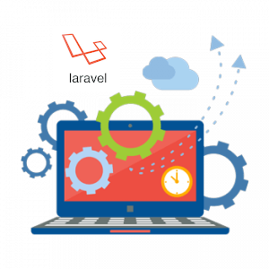

  
  <h1>Laravel Backoffice Example</h1>

  Laravel Backoffice Example is a <a href="https://laravel.com/>Laravel</a> simple CRUD, with authentication login, and somewhat basic functionalities.

> **Note:** This project is ment to be used with the [Vue Backoffice Example](https://github.com/guastallaigor/vue-backoffice-example).
> It has all the functionalities that is used with this project.
> This project uses Laravel 5.7.

## Quick start

You will need Docker and Docker compose. Inside the container it has two services, one with PostgreSQL database and the other with PHP 7.2 Nginx. 

Clone this repository, create a `.env` file from `.env.example` (don't forget to change to your datase connections and keys) and then run `docker-compose up`.

If it's your first time running, run `docker-compose exec app bash`. Then run `composer install`.

After you will need to run the migrations. Inside the container, run `php artisan migrate`.

If you want to run the seeds, add the `--seed` to the command above.

By default it runs on `localhost:3000`.

## API Information Table

Method | Request URL | Description
--- | --- | --- | ---
GET | api/v1/backoffice/employee | List of employees
GET | api/v1/backoffice/employee/:id | Get one employee
POST | api/v1/backoffice/login | JWT Login
POST | api/v1/backoffice/employee | Create a new employee
POST | api/v1/backoffice/employee/active/:id | Change an employee to active
POST | api/v1/backoffice/employee/inactive/:id | Change an employee to inactive
DELETE | api/v1/backoffice/employee/:id | Delete an employee

## TODO

* [ ] Add Travis CI.
* [ ] Add Scrutinizer CI.
* [ ] Add unit tests.
* [ ] Add more functionalities.
* [ ] Add 90%+ test coverage.

## License

MIT © [guastallaigor](https://github.com/guastallaigor)
